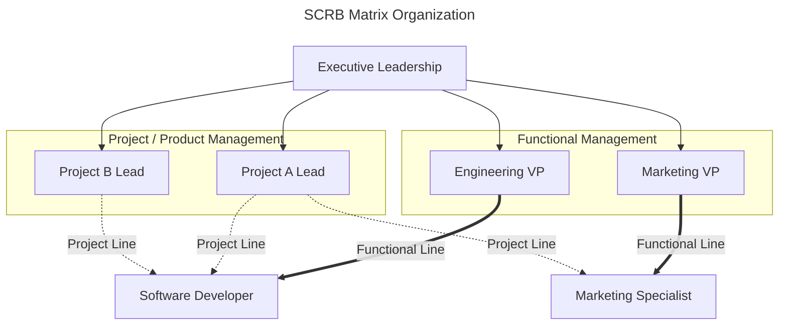

```mermaid
---
title: SCRB Matrix Organization
---
graph TD
    %% Executive Level
    CEO[Executive Leadership]

    %% Functional Managers
    subgraph Functional_Leadership [Functional Management]
        FM_Eng[Engineering VP]
        FM_Mkt[Marketing VP]
    end

    %% Project / Product Managers
    subgraph Project_Leadership [Project / Product Management]
        PM_A[Project A Lead]
        PM_B[Project B Lead]
    end

    %% Matrix Staff Units
    Dev1[Software Developer]
    Mkt1[Marketing Specialist]

    %% Hierarchical Connections
    CEO --> FM_Eng
    CEO --> FM_Mkt
    CEO --> PM_A
    CEO --> PM_B

    %% Functional Reporting (Solid Lines)
    FM_Eng ==>|Functional Line| Dev1
    FM_Mkt ==>|Functional Line| Mkt1

    %% Project / Cross-Functional Reporting (Dashed Lines)
    PM_A -.->|Project Line| Dev1
    PM_A -.->|Project Line| Mkt1
    PM_B -.->|Project Line| Dev1
```
