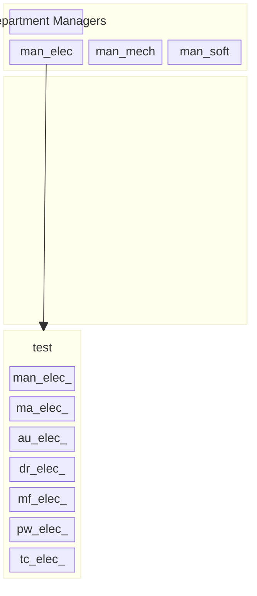

```mermaid
---
title: SCRB Matrix Organization
---
block
    columns 3
    block:test:3
        columns 3
        man["Department Managers"]:3
        man_elec man_mech man_soft
    end
    block:empty:3
        %% columns auto (default)
        space
    end
    block:meme:1
        columns 1
        uct("test")
        man_elec_
        ma_elec_
        au_elec_
        dr_elec_
        mf_elec_
        pw_elec_
        tc_elec_
    end
    man_elec --> meme
class uct BT
classDef BT stroke:transparent,fill:transparent
```
