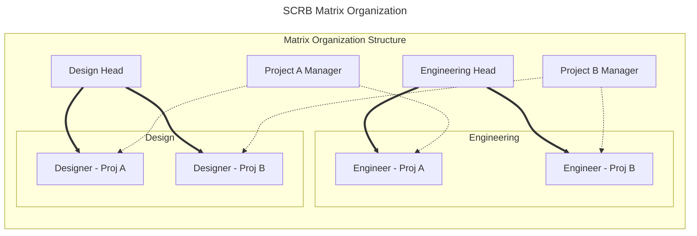

```mermaid
---
title: SCRB Matrix Organization
---
graph LR
    subgraph Matrix [Matrix Organization Structure]
        direction TB

        %% Columns / Functions
        subgraph Col1 [Engineering]
            Dev1[Engineer - Proj A]
            Dev2[Engineer - Proj B]
        end

        subgraph Col2 [Design]
            Des1[Designer - Proj A]
            Des2[Designer - Proj B]
        end

        %% Project Rows (Visual Grouping)
        PM_A[Project A Manager]
        PM_B[Project B Manager]

        %% Functional Reporting
        FM_Eng[Engineering Head] ==> Dev1
        FM_Eng ==> Dev2
        FM_Des[Design Head] ==> Des1
        FM_Des ==> Des2

        %% Project Reporting
        PM_A -.-> Dev1
        PM_A -.-> Des1
        PM_B -.-> Dev2
        PM_B -.-> Des2
    end
```
